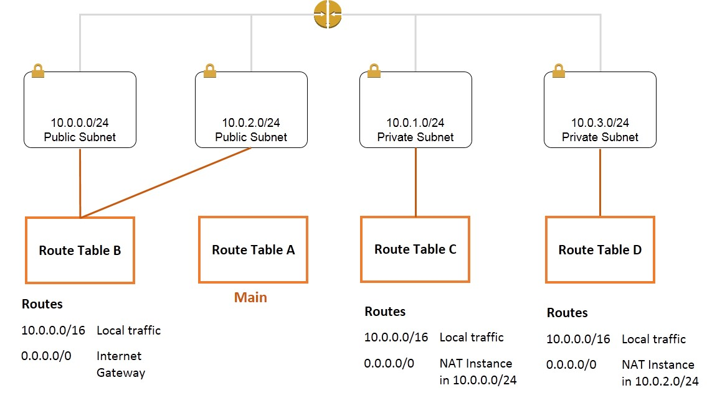

Samples for AWS infra as a code
===============================

Currently, there are 3 categories:
- **aws-cli**: frequent aws cli sample commands
- **terraform**
  - [**bjs-infra**](#bjs-infra): terraform sample for AWS BJS(China) region
  - **devops-codex**: terraform sample for usage of AWS code pipeline,code deploy & code build (it depends on **ecs-infra**)
  - **ecs-infra** : terraform sample for AWS ECS global region


bjs-infra
---------
For BJS(China) region samples, we build a sample for managing BJS :

- VPC : how to create a VPC
- Subnets: Public & Private subnets
- Routes : how to create & update routes
- IAM : how to create and use IAM roles
- IGW : internet gateway for instances in public subnets access internet
- NAT Instances(ec2): because BJS region has no managed NAT Gateway service, so this sample demos how to create a HA NAT instances for two private subnets

NAT HA Architect
-------------------



- 假定我们有两个 NAT 实例，NAT#1 和 NAT#2；两个私有子网，private subnet#1和private subnet#2；两个子网路由route1 和route2，route1 关联到private subnet#1，route2关联到private subnet#2；
- 初始化route1的外网路由，0.0.0.0/0 转发到 NAT#1；
- 初始化route2的外网路由，0.0.0.0/0 转发到 NAT#2；
- 两个 NAT 实例中配置运行 nat_monitor.sh 脚本；该脚本定时检查另一个 NAT 实例状态；如果发现另外一个NAT实例不工作，那么就会修改本来路由到该NAT（不工作的NAT实例）的路由表记录指向健康的NAT实例（自己）；如果该脚本发现自己恢复了，就会重置关联到自己的私网转发路由记录重新指向自己；

Prerequisite:
-------------

**准备好 Terraform 的环境：**

1. 下载 [Terraform 0.9+](https://www.terraform.io/downloads.html)
2. 对于 Linux 操作系统, 解压 terraform 命令创建文件链接
```sh
unzip [PATH]/terraform*.zip
cd /usr/bin
sudo ln -s [PATH]/terraform
```
3. 验证你的 [Terraform 环境](https://www.terraform.io/intro/getting-started/install.html)

**准备好 AWS 环境** 

- 一种方式是在 Terraform 的配置文件中 provider 模块显式注明 AWS access_key & secret_key
```
provider "aws" {
  access_key = "ACCESS_KEY_HERE"
  secret_key = "SECRET_KEY_HERE"
  region     = "us-east-1"
}

resource "aws_instance" "example" {
  ami           = "ami-2757f631"
  instance_type = "t2.micro"
}

```
- 另外一种方式是在 AWS 上通过给EC2 Instance 绑定合适的 IAM 角色（推荐）

- 还需要准备一个 Keypair （密钥对）用来绑定到新启动的 EC2 实例上，进行后续的登陆和操作

运行 Terraform BJS Sample:
-------------------------

参考以下步骤来体验 BJS 的 Terraform 样例：

```sh
sudo git clone https://github.com/soldierxue/infra-as-code-samples
cd ./infra-as-code-samples/terraform/bjs-infra
sudo cp [PATH]/bjskey.pem ./infra-nat/scripts/
sudo chmod 600 ./infra-nat/scripts/bjskey.pem
sudo terraform get --update
sudo terraform plan --var-file bjs.tfvars
```

执行所有的模块的创建：

```sh
sudo terraform apply --var-file bjs.tfvars
```

执行指定模块的创建：

```sh
sudo terraform apply --var-file bjs.tfvars -target module.aws-vpc
sudo terraform apply --var-file bjs.tfvars -target module.securities
sudo terraform apply --var-file bjs.tfvars -target module.natgateways
```

通过 Terraform ：

```sh
sudo terraform destroy --var-file bjs.tfvars
```
