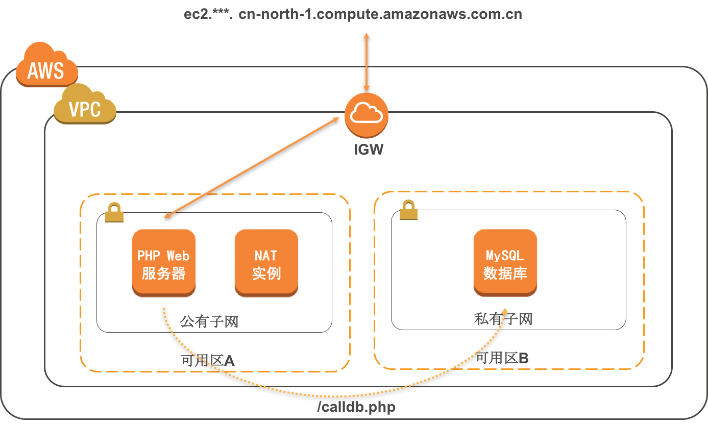

# Samples for AWS Infra as a code (IaC) using Terraform

AWS-Global Regions
------------------
For AWS global region samples, we build a sample to demo :

- VPC : how to create a VPC
- Subnets: Public & Private subnets
- Routes : how to create & update routes
- IAM : how to create and use IAM roles
- IGW : internet gateway for instances in public subnets access internet
- NAT Services
- PHP Demo: php website with a db call to backend mysql , use this website to verify the VPC resources are created correctly

**准备好 AWS 环境** 

## 准备一个 Cloud 9 的环境作为本次实验的工作机

参考[如下文档](./环境准备/准备%20Cloud%209%20实验环境.md)

## 了解 Terraform AWS provider 的基本认证授权方式

- 一种方式是在 Terraform 的配置文件中 provider 模块显式注明 AWS access_key & secret_key
```hcl
provider "aws" {
  access_key = "ACCESS_KEY_HERE"
  secret_key = "SECRET_KEY_HERE"
  region     = "us-east-2"
}

resource "aws_instance" "example" {
  ami           = "ami-2757f631"
  instance_type = "t2.micro"
}

```
- 另外一种方式是在 AWS 上通过给 EC2 Instance 绑定合适的 IAM 角色（推荐）

## 准备一个 Key Pair 用来登陆 EC2 Instance

- 还需要准备一个 Keypair （密钥对）用来绑定到新启动的 EC2 实例上，进行后续的登陆和操作

```sh
aws ec2 create-key-pair --key-name demokey --query "KeyMaterial" --output text > ~/demokey.pem
chmod 400 ~/demokey.pem
```

## 同步样例代码

```sh
sudo git clone https://github.com/soldierxue/infra-as-code-samples
```

### 第一个例子：创建一个 VPC

```sh

cd ./infra-as-code-samples/global/vpcfull

# Everytime your dependancies lib updates, you need to refresh the new modules
sudo terraform init -upgrade
sudo terraform get --update
sudo terraform plan 
sudo terraform apply

```
该实验的部分样例代码（创建一个网络基础设施）如下，用户只需要关注准备的必要参数，通过 *stack_name* 和 *environment* 参数设置，用户可以创建不同的环境比如生产环境、测试环境，预生产环境等等。

```hcl
# For AWS Cloud
provider "aws" {
  region = "us-east-2"
}

module "my-vpc" {
  source          = "github.com/soldierxue/terraformlib/global-vpc"
  base_cidr_block = "10.0.0.0/16"
  name = "1st-vpc-demo"
  environment = "test"
  private_subnets_cidr = ["10.0.48.0/20","10.0.112.0/20","10.0.144.0/20","10.0.176.0/20","10.0.208.0/20","10.0.240.0/20"]
  public_subnets_cidr = ["10.0.0.0/20","10.0.16.0/20","10.0.64.0/20","10.0.96.0/20","10.0.128.0/20","10.0.160.0/20"]
}

```

销毁整个实验创建的 AWS 资源：

```sh
sudo terraform destroy
```

### 第二个例子：PHP Demo

PHP Demo Architect
------------------



- 通过 Terraform 分别在公有子网和私有子网创建两台EC2
- 通过 EC2 的 User Data 配置好 PHP 和 MySQL 环境
- calldb.php 测试和 私有子网的 MySQL 实例的联通性

学习：
- 如何把 Terraform 状态信息保存到 S3
- 如何通过 Terraform 创建 EC2 Instance 并关联 User Data

```sh
export S3NAME="terraform"$(date +%s)
echo $S3NAME
aws s3 mb s3://$S3NAME
```

检查样例代码里面的参数配置是否一致, 尤其是 S3 存储桶名和 Keypair 的名称：

```sh
sudo vi ./infra-as-code-samples/global/phpdemo/main.tf
```

```hcl
provider "aws" {
  region = "us-east-2"
}

terraform {
  backend  "s3" {
    bucket = "[replace_with_you_bucket_name]"
    key    = "network/terraform.tfstate"
    region = "us-east-2"
  }
}

module "apstack" {
    source = "github.com/soldierxue/terraformlib"
    stack_name = "jasonstack"
}

module "demophp" {
    source = "github.com/soldierxue/terraformlib/demo-php"
    name ="${module.apstack.stack_name}"
    environment = "${module.apstack.environment}"
    vpc_id          = "${module.apstack.vpc_id}"
    public_subnet_id = element(module.apstack.subnet_public_ids[0],0)
    fronend_web_sgid = "${module.apstack.sg_frontend_id}"

    private_subnet_id = element(module.apstack.subnet_private_ids[0],0)
    database_sgid = "${module.apstack.sg_database_id}"

    ec2keyname = "[replace_with_your_key_pairname]"
}
```

- Copy the PHP EC2 instance public DNS and open in your browser

```hcl
...

Outputs:

phpAddress = "ec2-18-222-168-31.us-east-2.compute.amazonaws.com"
```

Try http://[Your_PHP_Address]/calldb.php to enjoy it.

销毁整个实验创建的 AWS 资源：

```sh
sudo terraform destroy
```