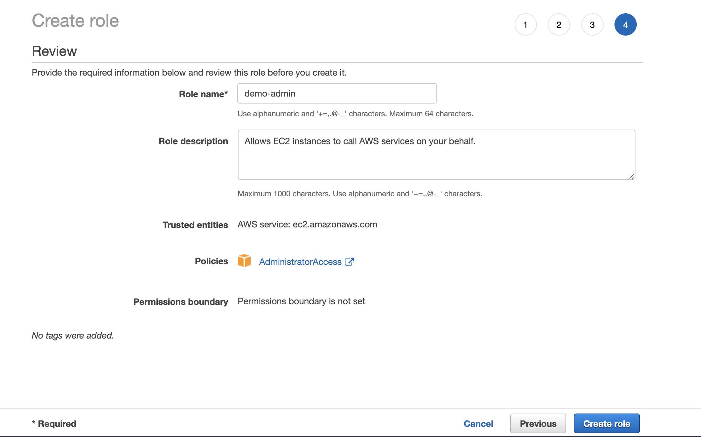

# 实验进行的前提：准备好 Cloud 9 的环境

本环境的创建和设定满足容器+竞价实验的 AWS 海外区域实验要求

1. 创建配置 Cloud 9
2. 实验结束后删除 Cloud 9 

---

## 创建一个 Cloud 9 的环境，安装配置好如下工具环境

> 打开如下 Cloud 9 控制台页面创建我们实验所需的 Web IDE（把区域改成你所想要的区域，默认在 us-east-1）：https://us-east-2.console.aws.amazon.com/cloud9/home
> 点击 “Create Environment”, IDE 命名 "workshop-terraform-aws", Instance Type 选择 “t3.small"，其他选项都默认。

> Cloud9 通常动态生成 IAM 的认证授权信息，我们直接给 Cloud 9 EC2 实例附加一个管理员权限的 IAM 角色，并禁止掉 Cloud9 默认的动态 IAM认证授权信息：
> 创建 IAM 角色, (1) 第一步选择 AWS service 并选择 EC2 （2）权限中选择 AdministratorAccess （3）输入角色名字 demo-admin 



> 将刚刚创建的 角色绑定到 Cloud 9 EC2 实例上


> 更新 Cloud 9 默认的 IAM 权限模式


> 在 cloud 9 的命令行控制台，安装配置好实验所需的工具：
> 确保 awscli 的版本最新，以及按照必要的工具

```sh
sudo pip install -U awscli
sudo yum -y install jq gettext
```

> 安装 Terraform：


1. Download [Terraform 0.9+](https://www.terraform.io/downloads.html)
2. For Linux system, 
```sh
wget https://releases.hashicorp.com/terraform/0.14.10/terraform_0.14.10_linux_amd64.zip
unzip terraform_*.zip
sudo mv terraform /usr/local/bin/
sudo chmod +x /usr/local/bin/terraform
terraform --version
```
3. Varify [Terraform 环境](https://www.terraform.io/intro/getting-started/install.html)

## 配置实验所在的 AWS 区域
```sh
    export AWS_DEFAULT_REGION=us-east-2
    echo "export AWS_DEFAULT_REGION=${AWS_DEFAULT_REGION}" >> ~/.bashrc
```

---
## 关闭 Cloud 9 演示环境(整个实验完成后)

    CLOUD_9_IDS=$(aws cloud9 list-environments | jq -c ".environmentIds | flatten(0)" | sed -E -e 's/\[|\]|\"|//g' | sed 's/,/ /g')
    CLOUD_9_WORKSHOP_ID=$(aws cloud9 describe-environments --environment-ids $CLOUD_9_IDS | jq '.environments | .[] | select(.name=="workshop-spot-container") | .id ' | sed -e 's/\"//g')
    aws cloud9 delete-environment --environment-id $CLOUD_9_WORKSHOP_ID
