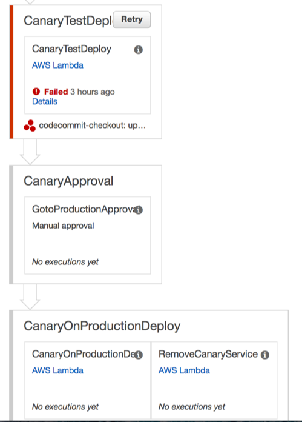
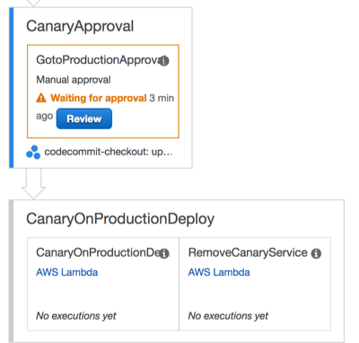
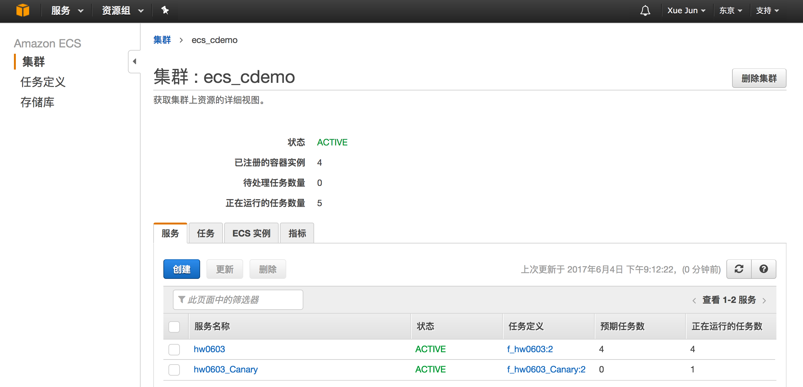
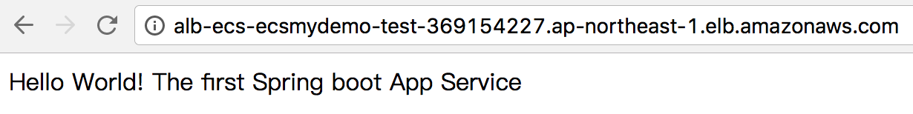

Samples for AWS Global Services
===============================
- **[Quick Start for ECS Demo](#quick-start-ecs)**
  - **[LAB1](#lab1)**: This Lab guide you to prepare a necessary repository like Code Commit & Elastic Container Registry, and the demo Spring Boot (java) projects
  - [**LAB2**](#lab2): This Lab followed [LAB1](#lab1) to create a CodePipeline, including retrived source code from CodeCommit, buid the project as Docker Image and store it to ECR, and following by Lambda functions to do ECS service updates
  - [**LAB3**](#lab3): We have completed [LAB2](#lab2) & [LAB3](#lab3), that we have souce code repo, code build, Docker Image Registry, and have a pipeline to automation the whole process. Here is Lab3, we will provision the backend ECS cluster & instances, ALB & target groups, service & tasks.

Architect Overview
------------------
- **[ECS Architect](#ecs-architect)**: Architect for ECS demo service
- **[Codepipeline Snapshot](#codepipeline-snapshot)**: Picture to show the codepipeline result
- **[ECS Snapshot](#ecs-snapshot)**: Picture to show the ECS result


AWS-Global
---------
For AWS global region samples, we build a few sample for managing VPC, ECS, Code* related user cases :

- Networking : VPC , Subnets, Routes, IGW, NAT Gateways for each Public Subnets
- PHP Demo: php website with a db call to backend mysql , use this website to verify the VPC resources are created correctly
- DevOps: Currently I will focus on Docker (ECS) based pipeline demos
- ECS : Show how to create ECS cluster, ASG, Service & Tasks


Prerequisite:
-------------
To refer to [BJS README](https://github.com/soldierxue/infra-as-code-samples) for how to prepare your Terraform & AWS environment.


Quick Start for ECS Demo
------------------------

参考以下步骤来体验 Global 的 Terraform ECS 样例：

LAB1
----
This Lab guide you to prepare a necessary repository like Code Commit & Elastic Container Registry, and the demo Spring Boot (java) projects.

第一个实验对于ECS 整个演示必要的准备阶段，该阶段，我们需要准备：
- 一个源代码库，目前只支持 CodeCommit （计划支持 Github）
- 一个 Docker Image 的存储库，目前只支持 AWS ECR
- 将 Spring Boot 的演示项目代码复制到你的代码库供后续实验使用（如果你利用现有的代码库和ECR存储库，只需要执行该步骤）


```sh
sudo git clone https://github.com/soldierxue/infra-as-code-samples
cd ./infra-as-code-samples/global/repo-prepare

sudo terraform get --update
sudo terraform plan 
sudo terraform apply
```

该实验默认会在区域 *ap-northeast-1* 创建好如下所示的代码库和ECR存储库，记录这些信息供后面的实验使用：


```hcl
Outputs:

ecr_arn = arn:aws:ecr:ap-northeast-1:[aws_account_id]:repository/ecr_demo_jason
ecr_name = ecr_demo_jason
ecr_repo_url = [aws_account_id].dkr.ecr.ap-northeast-1.amazonaws.com/ecr_demo_jason
repo_clone_url_http = https://git-codecommit.ap-northeast-1.amazonaws.com/v1/repos/cc_demo_jason
repo_clone_url_ssh = ssh://git-codecommit.ap-northeast-1.amazonaws.com/v1/repos/cc_demo_jason
repo_name = cc_demo_jason
```

初始化针对刚刚创建的 CodeCommit 代码库的本地工作目录：

```sh

git config --global credential.helper '!aws codecommit credential-helper $@'
git config --global credential.UseHttpPath true
git clone https://git-codecommit.ap-northeast-1.amazonaws.com/v1/repos/cc_demo_jason
git clone https://github.com/soldierxue/springdemo
cp -r ./springdemo/* cc_demo_jason/
cd cc_demo_jason/
git add *
git commit -m "spring demo"

```

检查SpringDemo 的示例代码已经CheckIn到刚刚创建的 CodeCommit代码库中。

LAB2
----
运行该样例之前请准备好：
- [LAB1](#lab1)的实验内容已经准备妥当

**注**：该实验创建一个完整的 DevOps 流水线，但由于我们还未创建 ECS Cluster，故代码并未真正部署和更新

$ cd ./infra-as-code-samples/global/devops-demo

检查该实验的输入参数，如下：
$ vi inputs.tfvars

```hcl
region = "ap-northeast-1"

code_pipeline_name_prefix="cp-mydemo" 

ecr_region = "ap-northeast-1" # ECR information
ecr_repo="ecr_demo_jason"

esc_cluster_name="ecs_cdemo"  # ECS information (will be used in LAB3)
ecs_service_name="hw0603"
ecs_family_name = "f_hw0603"

## Policy for service deployment: "InPlaceDoubling"|"InPlaceRolling"|"Canary"
service_deploy_policy = "Canary"

cc_repo="cc_demo_jason" # Code Commit Repository information
```
参数检查/设定好之后就可以创建 Code Pipeline 了：

```sh
cd ./infra-as-code-samples/global/devops-demo

sudo terraform get --update
sudo terraform plan --var-file inputs.tfvars
sudo terraform apply --var-file inputs.tfvars
```

BJS-LAB3
--------
运行该样例之前请准备好：
- 你已经成功执行 [LAB2](#lab2)

本实验是创建底层的VPC，ECS群集，Auto Scalling 组以及定义ECS 服务和Task：

$ cd ./infra-as-code-samples/global/ecs-demo

检查该实验的输入参数，如下：
$ vi inputs.tfvars

```hcl
stack_name = "ecsmydemo"
asg_min = "2"
asg_max = "10"
asg_desired_size = "4"
key_pair_name  = "ap-north1-key"

## variables for service and task
docker_tag = "LATEST"
container_cpu = "200"
container_memory = "300"
container_port = "8080"
task_desired_count ="1"
```

```sh
cd ./infra-as-code-samples/global/ecs-demo

sudo terraform get --update
sudo terraform plan --var-file inputs.tfvars --var-file ../devops-demo/inputs.tfvars
sudo terraform apply --var-file inputs.tfvars --var-file ../devops-demo/inputs.tfvars
```

到此我们的整个 ECS demo的组件都已经构建完成，我们再从AWS 控制台回到 [LAB2](#lab2) 创建的 CodePipeline 页面，点击CanaryTestDeploy的 Retry 按钮继续我们的部署：



Canary Task部署完之后，等待我们确认Canary Task没有问题，我们可以审批通过进行生产环境的Task更新以及将在运行的Canary移出Target Group：


Canary 部署模式下的集群及服务状态：


我们的 Spring Cloud Hello World1 服务：
