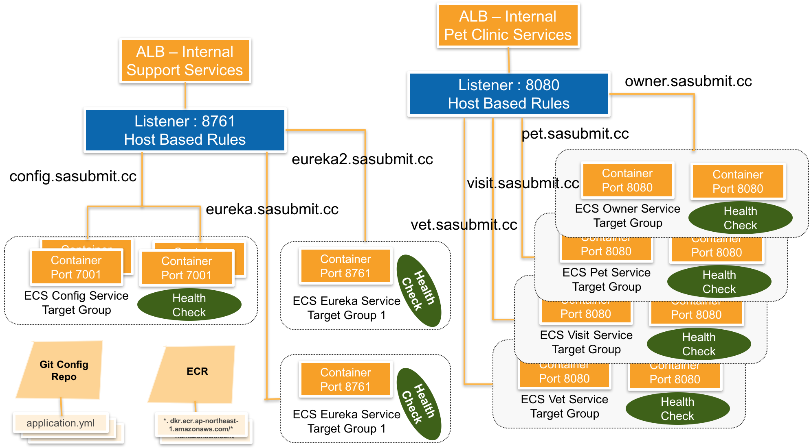

Samples for AWS Global Services
===============================
- **Quick Start for Spring ECS Demo**
  - **[LAB1](#lab1)**: This Lab guide you to have a taste of running pet clinic services using docker-compose in a single host, we prepared scripts to create Elastic Container Registry for each service, and to build and push images to it. Finally we run the services by docker compose commands.
  - [**LAB2**](#lab2): This Lab followed [LAB1](#lab1) to run the same services on ECS cluster together with Route53 for private DNS resolver for config and service discovery services.


Architect Overview
------------------
- **[Spring ECS Architect](#ecs-architect)**: Architect for Spring ECS demo service


AWS-Resource & State Management
-------------------------------
For AWS global region samples, we build a few sample for managing VPC, ECS, Route53,related user cases :

- Networking : VPC , Subnets, Routes, IGW, NAT Gateways for each Public Subnets
- Bastion EC2 instances: because all ECS instance are in private subnets, so we need a basion instance to check the backen ECS services
- ECS : In this case we demo a complicated scenario, that the with 4 pet clinic services and 2 supporting services, how to render the required resources for these services to be deployed


Prerequisite:
-------------
To refer to [README](https://github.com/soldierxue/infra-as-code-samples) for how to prepare your Terraform & AWS environment.


Quick Start for Spring ECS Demo
--------------------------------
LAB1
----
```sh
sudo git clone https://github.com/soldierxue/infra-as-code-samples
cd ./infra-as-code-samples/spring-ecs

sudo terraform get --update
sudo terraform apply --target module.ecr_regs --var-file inputs.tfvars # Create aws elastic container registries
```

Following we will check out the source codes and to build/push images to above created ECR:

```sh
sudo git clone https://github.com/soldierxue/spring-ecs
cd ./spring-ecs/lab2/

$(aws ecr get-login --region ap-northeast-1)
cat ~/.docker/config.json

# before you run following script, please ensure you are ready for **docker, maven, python3.x, boto3 environment**

python buildimages.py -m setup -r ap-northeast-1

```

Until now, we have docker images been pushed to our AWS ECRs , so we are ready to use docer-compose to setup the whole petclinic services in one host:

```sh
cd ./spring-ecs/lab2/

export docker_registry_host=[your_account_id].dkr.ecr.[region_name].amazonaws.com

docker-compose up -d

# review the docker processes
docker-compose ps

# scale the pet services
docker-compose scale owner-service=2

```

LAB2
----
First of all, we need to prepare necessary  AWS resources like ECR repositories, ECS clusters, ECS services & tasks, ECS auto scaling group, ALB & Target Groups and Route 53 records:


```sh
sudo git clone https://github.com/soldierxue/infra-as-code-samples
cd ./infra-as-code-samples/spring-ecs

sudo terraform get --update
sudo terraform plan --var-file inputs.tfvars
sudo terraform apply --var-file inputs.tfvars
```

This lab will by default create a new VPC and related AWS resources in region *ap-northeast-1*

Next steps, we will try our pet services, config service & eureka service discovery services:

[TO BE Continued]


Spring ECS Architect
-------------

